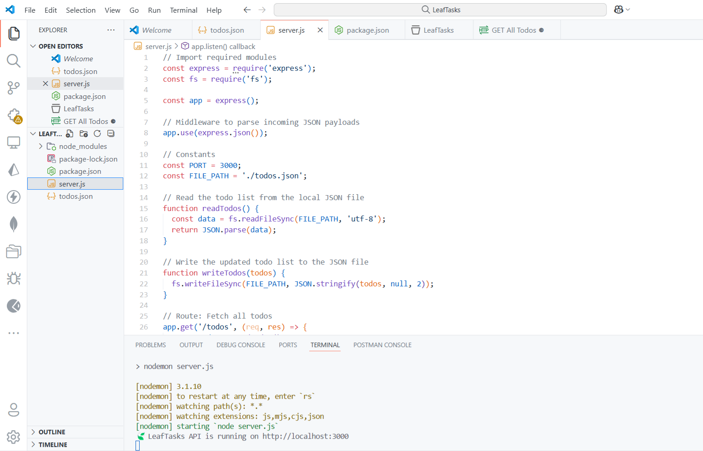
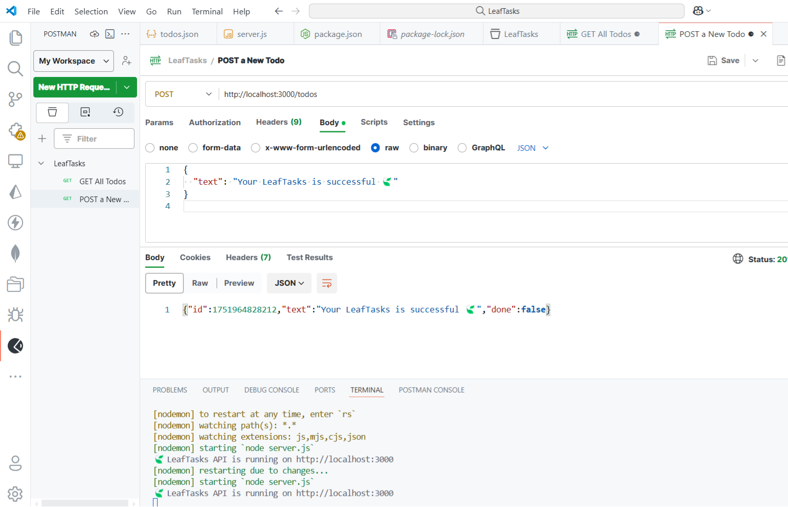
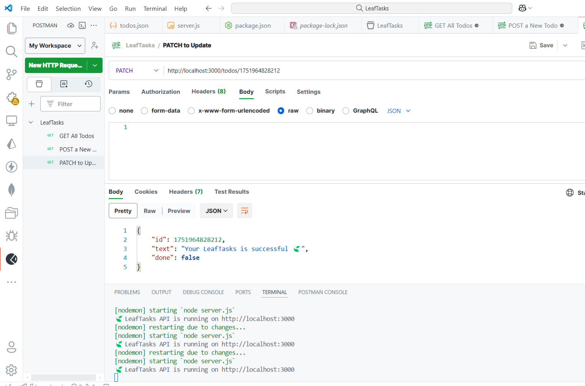
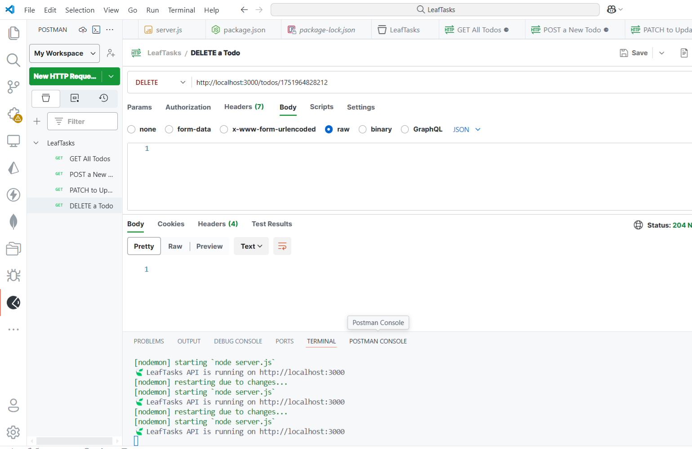
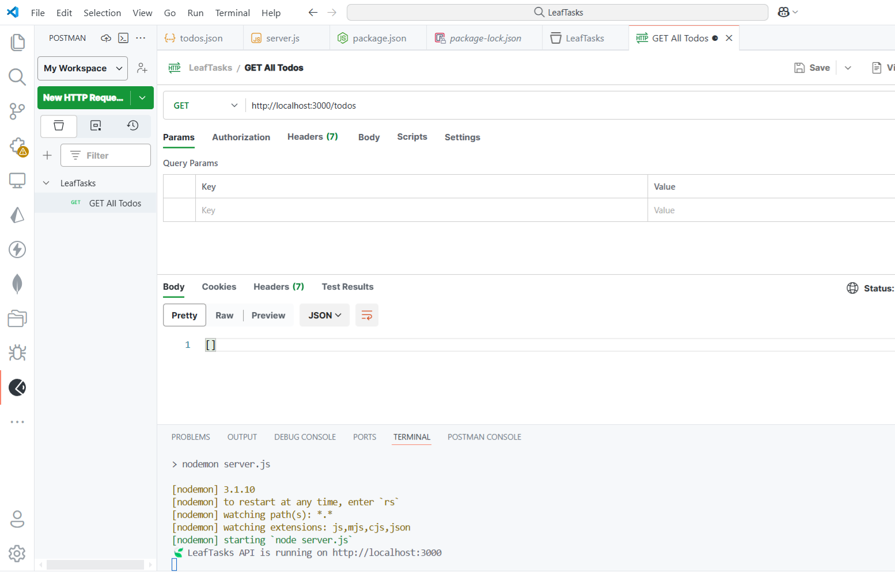

# 🍃 Backend-LeafTasks-Api

A clean and lightweight **todo backend API** built with **Node.js + Express**, using local `.json` file storage. Perfect for minimal full-stack prototypes, personal projects, or educational purposes.


---

## Features

-  No database required – uses `todos.json` as storage
-  Full CRUD: `GET`, `POST`, `PATCH`, `DELETE`
-  Fast to set up and easy to scale
-  Tested using Postman
-  Ideal for frontend/backend integration or learning RESTful APIs


---

## Preview

### File Structure + Express Server  
> `server.js` & folder layout  


### API Tested via Postman

| Create Todo | Update Todo | Delete Todo |
|-------------|-------------|-------------|
|  |  |  |

### GET All Todos  



---

## Getting Started

### 1. Clone & Install

```bash
git clone https://github.com/ricoaprillananda/Backend-LeafTasks-Api.git
cd Backend-LeafTasks-Api
npm install

---

Run the Server
bash
Copy code
npm start
Server runs at: http://localhost:3000

```


---

⚗️ API Endpoints

```

Method	Endpoint	Description
GET	/todos	Retrieve all todos
POST	/todos	Add a new todo
PATCH	/todos/:id	Toggle "done" status
DELETE	/todos/:id	Remove a todo

```


---

Example Request Bodies

```

🍀 POST
json
Copy code
{
  "text": "Build LeafTasks API 🍃"
}

🌼 PATCH
json
Copy code
{
  "done": true
}

```
---

🪽 Tech Stack

```

- Node.js
- Express.js
- Postman
- Local .json file as data storage (no DB)

```

---

👤 Author
Rico Aprilla Nanda


